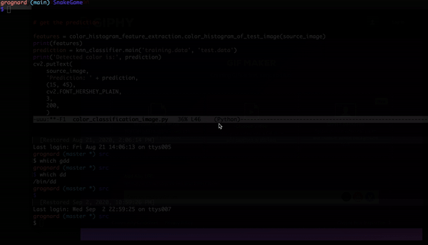

# SnakeGame
Object-Oriented Implementation of SnakeGame in C++. It features a some-what generic game engine class, that can be instantiated to implement different games. The type of games that can be implemented are limited to ones that follow the below generic framework.

- game state is limited to (game objects, input events)
- each game object is updated at time t, based on other game objects at t-1 and input events at t
- game objects are displayed to screen after update

The game engine is designed with the below principles in mind:-

- take advantage of Inheritance & Run-time Polymorphism
- RAII(Resource Allocation is Initialization)

[

### Build Instructions
1) This implementation uses SFML Graphic library. Hence copy SFML library files to your platform's usual locations(Ex:- headers to /usr/local/include & lib 
files to /usr/local/lib).
2) Clone this repo to your platform
3) Build executable using the below command. For more detailed instructions in compiling and linking programs using SFML, read 'Getting Started" section of the link
[SFML compile & link](https://www.sfml-dev.org/tutorials/2.5/).
```
g++ -std=c++14 -o SnakeGame SnakeGame.cpp Engine/Game.cpp Snake_Artifact.cpp Apple_Artifact.cpp -lsfml-graphics -lsfml-window -lsfml-system
```
Note:- For MacOSX some of the dependent dynamic libraries for SFML are provided as .framework files. Linking with .framework files requires additional flags on g++ the commandline. A somewhat detailed instructions on how to do this on MacOSX is provided here [Linking with Frameworks on OSX](compiling_and_linking_withSFML.txt).
Below is an example of how the command looks on MacOSX.
```
g++ -std=c++14 -o SnakeGame SnakeGame.cpp Engine/Game.cpp Snake_Artifact.cpp Apple_Artifact.cpp -F /Users/grognard/Downloads/SFML-2.5.1-macos-clang/extlibs/Frameworks -rpath /Users/grognard/Downloads/SFML-2.5.1-macos-clang/extlibs/Frameworks -framework FLAC -framework freetype -framework ogg -framework OpenAL -framework vorbis -framework vorbisenc -framework vorbisfile -lsfml-graphics -lsfml-window -lsfml-system
```
### Game Architecture
#### Classes:-
The game is built on 2 main classes.
1) Game:- 
This class is the Game Engine. It consists of the below methods.
   - init
     - Initializes Game Engine with screen-res, game refresh rate & game font
   - add_Artifacts
     - Adds Game Artifacts to Game Engine. A Game Artifact is an abstraction of object displayed in the game
   - run
     - Run the Game Engine
   - end
     - End the Game Engine
     

Below are protected methods 
   - update_State
     - updates Game Artifacts based on input game events & Game env(other game artifacts). Can be overriden in a sub-class
   - get_Input
     - polls user inputs like keystrokes,  mouse-clicks etc.
   - get_Score
     - calculates and returns game score. Can be overriden in a sub-class
2) Artifact:- This class is abstact concept of a game object. It should be implemented. For Snake Game we define 2 sub-classes - Snake_Artifact & Apple_Artifact 
which implement this abstract class.
Below are the pure-virtual methods that should be implemented.
   - update
     -  updates artifact based on game environment & input events
   - draw
     -  draws artifact to screen
   - get_Position
     -  returns position of the artifact of the screen
   - size
     -  returns size of the artifact
     
3) Snake_Artifact:- Implementation of Artifact abstract class. This represents the Snake artifact in the game.
4) Apple_Artifact:- Implementation of Artifact abstract class. This represents the Apple artifact in the game.

#### Putting Everything Together
SnakeGame.cpp puts everything together. It does the following in the order specified.
1) Creates game engine object.
2) Initializes the game engine object.
3) Creates game artifacts - Snake & Apple.
4) Adds the game artifacts to the game engine object.
4) Calls run method on game engine object
5) Calls end method on game engine object
